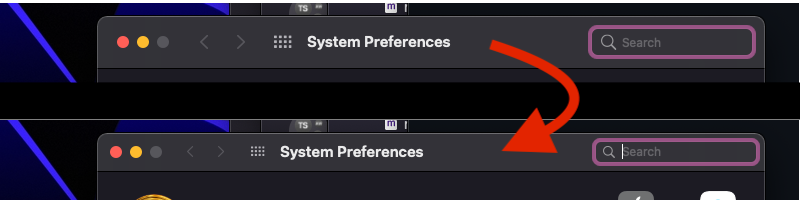

# MEMiniMe

# Information:

- Designed for 11.0+
- MEMiniMe is a MacForge Plugin that makes all window toolbars compact on Big Sur
- Author: [MacEnhance](https://github.com/MacEnhance)

# Functionality:

- Windows that use system drawn toolbar will be set to use `NSWindowToolbarStyleUnifiedCompact` 
- Note that this doesn't affect custom drawn titlebars / toolbars 

# Blacklisting:

- To add an app the blacklist

1. Find the bundle ID of the application you want to blacklist. EG: `com.googlecode.iterm2`
2. Open `/System/Applications/Utilities/Terminal.app`
3. Enter the command `defaults write com.googlecode.iterm2 MEMiniMeBlacklist -bool true`
4. Restart the application

- To remove an app, replace `true` with `false`

# Installation:

1. Download and open [MacForge](https://github.com/w0lfschild/app_updates/raw/master/MacForge1/MacForge.zip)
2. Install [MEMiniMe](https://www.macenhance.com/mflink?com.macenhance.MEMiniMe)
